# Documentation

Welcome to Sitecore Hackathon 2020.

This is the documentation for Team Pálinka submission

## Sitecore Hackathon Site

### Installation

Please install the related [package](sc.package/HackathonSite.zip) to a Clean Sitecore Instance. 
The package contains every necessary files and sitecore items.

### Module List

- Navigation
  - Header and Footer Included
  - Each PageItem under the HomeItem has a "Hide in Navigation" checkbox which prevents to display the page item in the navigation
  - Footer Navigation and Header Social Links can be edited in /sitecore/content/Hackathon/Global/Navigation folder
  - Link items must be selected on the FooterNavigation item's Links field
  - 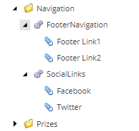
- FAQ Module
  - FAQ items can be edited in /sitecore/content/Hackathon/Global/FAQs folders
  - Each FAQ item has a Question and Answer field
  - You can FAQ render to any pages, FAQ rendering item datasource should point to /sitecore/content/Hackathon/Global/FAQs
  - 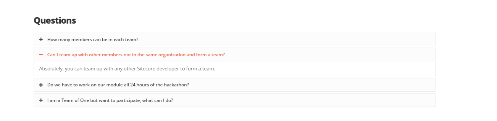
  - 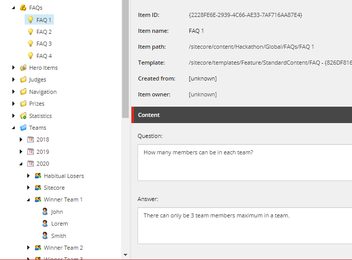
- Teams
  - Teams stored in a global folder by Year Seperated
  - Structure
    - Teams
      - 2018
        - Team1
          - Team Member1
          - Team Member2
      - 2019
        - ....
        - 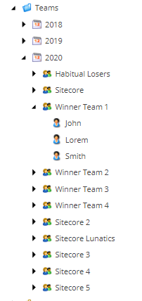
  - Fields
    - Team Template
      - Team Name - Name of the team. 
      - Country
      - Github Link (should be set once the repositories are done)
      - Category (should be set once the submission is done)
      - Is Winner (should be checked if the team is the winner in the given year)
  - Teams Page
    - List Teams from the selected year
    - 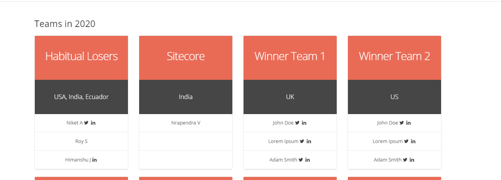
  - Teams Statistics
    - Shows statistics from the given year
    - 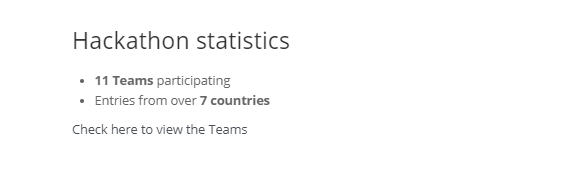
  - Recent Teams
    - Displays the recently signed up 5 teams
- Submission Page
  - A Sitecore form built to send submission
  - A Team Template has workflow settings, so it not displayed on the site immediatelly
  - There is validation for the unique team name
  - 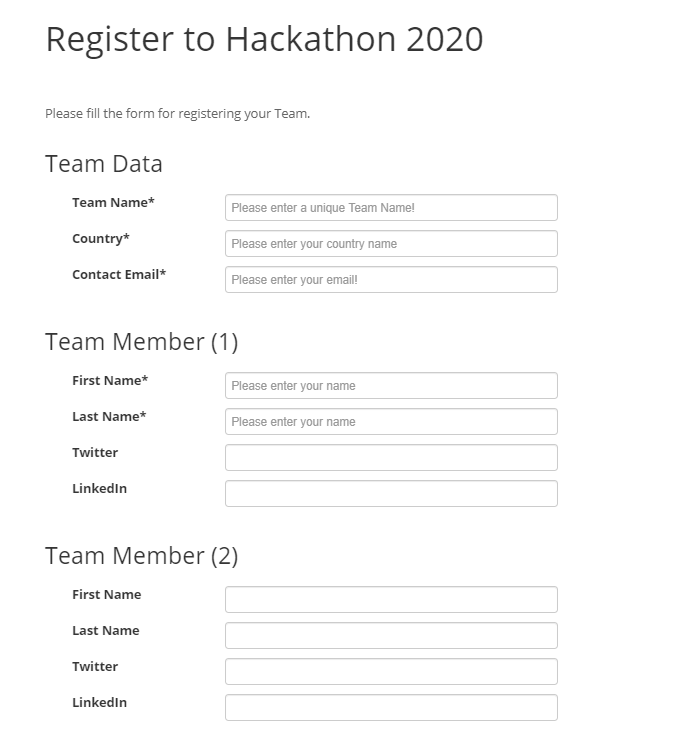
- Current Winner
  - Displays the winners from the current year. 
  - Selects teams from the proper folder where there **Is Winner** checkbox is ticked
  - 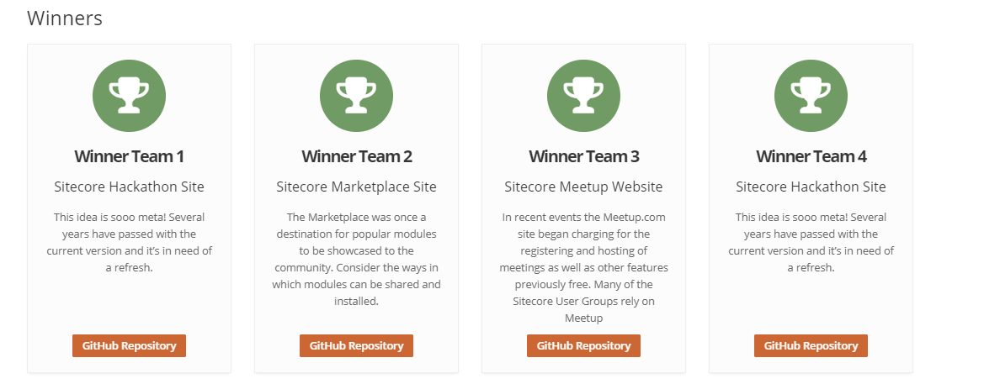
- Previous Winners
  - Displayed on the homepage
  - Automatically collects winner teams from the previous years and lists the category too
  - 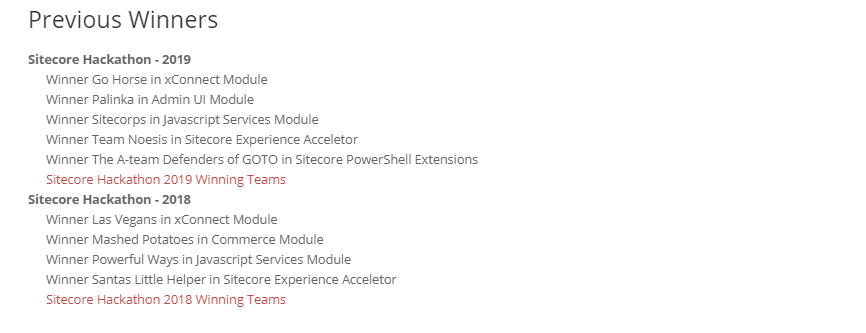
- Text Module
  - A simple rich text module can be inserted on any type of page. 
  - Text Datasource item can be created under the given **page's component folder**
  - 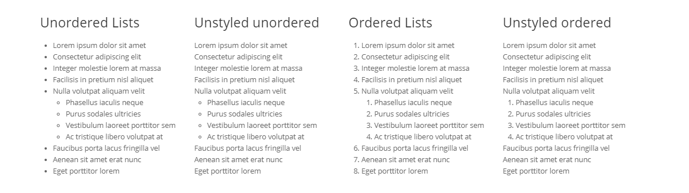
  - 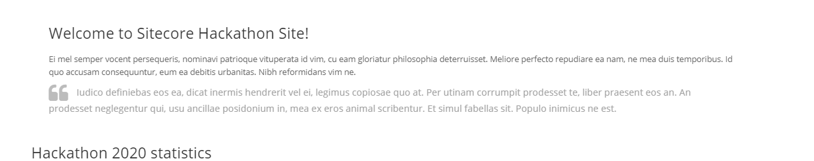
- Image Module
  - A single image module can be inserted on any type of page. 
  - Image Datasource item can be created under the given **page's component folder**
- Categories module
  - Displays information about the selected categories
  - Categories can be selected on Event Page in **Categories** field
  - 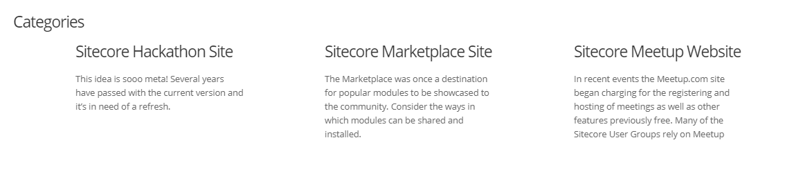
- Judges modules
  - Display judge's information  (community and Sitecore judges are seperated)
  - Judges can be selected on each **Event** **Page** in **Community Judges** and **Sitecore Judges** fields
  - 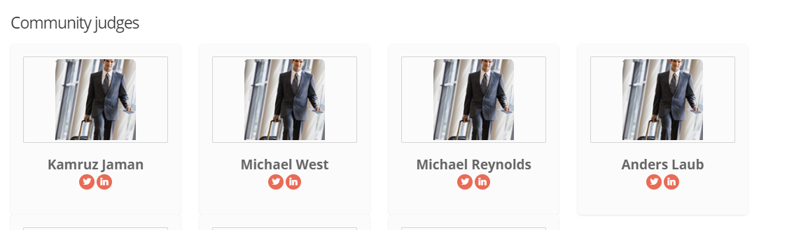
- Prizes module
  - Displays Prize items from /sitecore/content/Hackathon/Global/Prizes
  - Prizes must be selected on Event Page in **Prizes** field
  - 
- Testimonial Module
  - Display Testimonials items from - Image Datasource item can be created under the given **page's component folder**
  - The Testimationals can be selected on the Testimonial Rendering's datasource item. 
  - The Datasource item will be created in the given page's Component folders.
  - 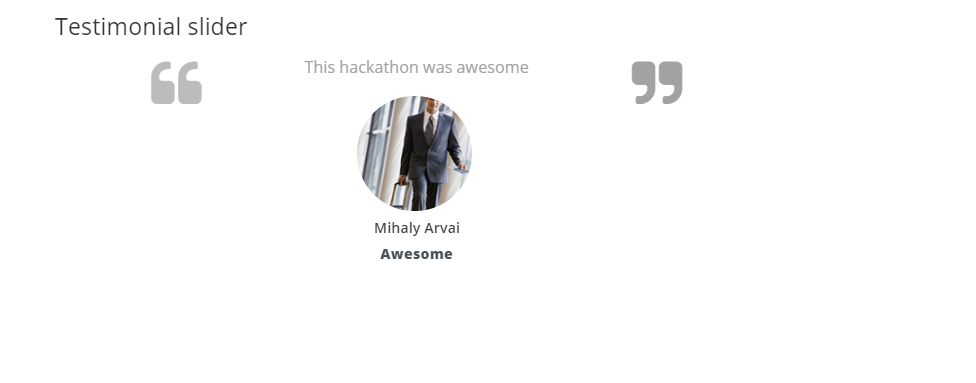
- Content Page
  - Any Type of module can be added to the Content Page
- Judge Application
  - A SPEAK3 based application to support judging process.
  - Lists Teams from the current team
  - A team can be opened and a Judge user can only add one review (Point and Comment pair)
  - The judge cannot add more review to the team.
  - 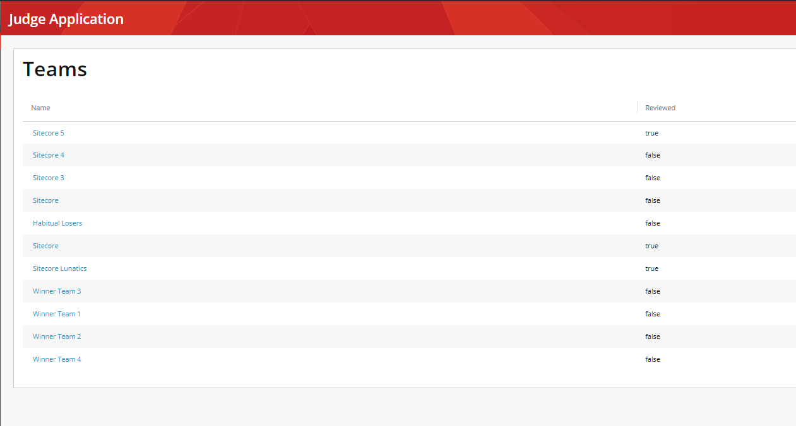
  - 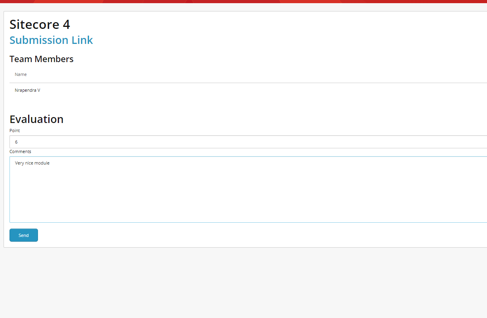